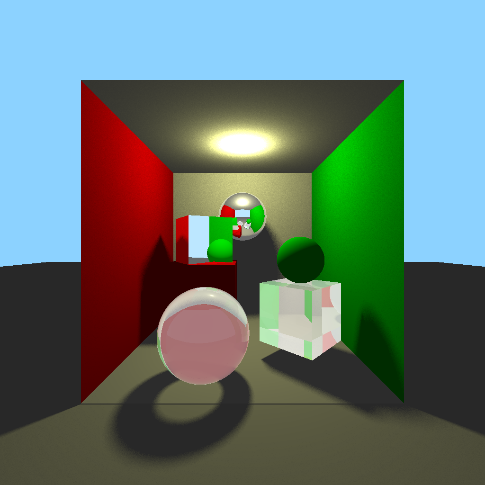

# CUDA Ray Tracing

A **modular, educational CUDA-based ray tracer** implementing a real-time **Cornell Box** with recursive reflections,
Lambertian shading, and optional post-processing filters.  
Designed for **clarity, modularity, and GPU computing education**, this project highlights how ray tracing can be
implemented efficiently from scratch using **CUDA C++**.


*Sample render output (Cornell Box, 1024×1024, GPU mode)*

---

## 🚀 Overview

This project demonstrates how to harness **GPU parallelism** for **physically based image synthesis** using **NVIDIA
CUDA**.

The renderer operates on both **CPU and GPU**, allowing users to measure and visualize real performance differences
between sequential and parallel execution models.

Key focus areas:

- Understanding **SIMT execution**, **memory hierarchies**, and **thread cooperation**
- Implementing **ray–object intersection** and **recursive shading**
- Managing **scene data transfers** between host and device
- Ensuring modularity across a multi-file CUDA/C++ project

---

## ✨ Core Features

### 🌗 Physically Inspired Rendering

- **Lambertian diffuse lighting** with soft shadow visibility
- **Recursive ray reflection** for mirror and glass materials
- **Point and directional light sources**
- **Energy-conserving BRDF** implementation (non-PBR, but consistent)

### 🧩 Modular Scene System

- Geometry primitives: **spheres**, **planes**, **quads**
- Composable worlds built through scene masks (bitwise combination)
- Predefined setups:
  - Cornell Box
  - Test spheres (diffuse, mirror, refractive)
  - Box composition using reusable quad generators

### ⚙️ Unified CPU & GPU Renderers

- Identical shading and geometry code paths for both backends
- Supports runtime configuration (resolution, postFX, scene mask, etc.)
- Simplified benchmarking: measure exact frame-time difference

### 💡 Flexible Material System

- Supports **diffuse**, **reflective**, and **refractive** materials
- Adjustable refractive index and reflectivity coefficients
- Shared material definitions through `Materials` namespace

### 📘 Comprehensive Documentation

- Fully documented with **Doxygen** (HTML + diagrams)
- Consistent docstrings across `.cuh` / `.cu` modules
- Includes:
  - Class inheritance graphs
  - Directory dependency graphs
  - Function parameter references and data flow

### 🖼️ Output & Post-Processing

- Export formats: **PPM** and **PNG**
- Optional watermark overlay (CPU-side bitmap draw)
- Built-in OS preview (Windows-only via ShellExecuteW)
- Gaussian and bilateral filter implementations for denoising

---

## 🧩 Directory Structure

```
CUDA-RayTracing/
│
├── docs/                                 # Documentation and reference material
│   ├── html/                             # Auto-generated Doxygen HTML output
│   └── preview_cornell_box.png           # Cornell Box render preview image
│
├── include/                              # Public headers shared across modules
│   ├── config/                           # Runtime configuration and constants
│   ├── core/                             # Core math types, vectors, RNG, and materials
│   ├── debug/                            # Debug utilities and light probe helpers
│   ├── geometry/                         # Primitive definitions (Sphere, Plane, Quad)
│   ├── io/                               # Image I/O, preview launcher, and watermark tools
│   ├── rendering/                        # Ray tracing, shading, and light sampling logic
│   ├── scenes/                           # Scene construction (Cornell Box, test cubes/spheres)
│   ├── third_party/                      # External libraries (LodePNG for PNG encoding)
│   ├── ui/                               # Runtime console interface and configuration menu
│   └── utils/                            # Helper modules: logging, timing, hashing, profiling
│
├── output/                               # Generated outputs: images and performance logs
│   ├── logs/                             # Render timing and performance CSV logs
│   ├── ppm/                              # Exported PPM images (uncompressed)
│   └── png/                              # Exported PNG images (compressed)
│
├── src/                                  # Source implementations (.cu / .cpp)
│   ├── io/                               # Image saving, watermarking, and preview backend
│   ├── log/                              # Performance measurement and file I/O
│   ├── postprocess/                      # Gaussian and Bilateral post-processing filters
│   ├── raytracer/                        # CPU and GPU rendering kernels
│   ├── ui/                               # Menu runtime logic and CLI configuration
│   └── main.cu                           # Program entry point (renderer launcher)
│
├── Test/                                 # Standalone CUDA validation and debug tests
│   └── main.cu                           # Simple kernel test to verify CUDA setup
│
├── CMakeLists.txt                        # Build configuration for CMake (CUDA + C++)
├── Doxyfile                              # Doxygen configuration file
├── LICENSE                               # MIT license text
└── README.md                             # Project overview and documentation

```

---

## 🛠️ Build Instructions

### 🔧 Requirements

To build and run the CUDA Ray Tracer, ensure the following dependencies are installed and properly configured:

| Component                                                        | Minimum Version | Notes                                                                                                            |
|:-----------------------------------------------------------------|:---------------:|:-----------------------------------------------------------------------------------------------------------------|
| **Windows**                                                      |  10 / 11 (x64)  | Fully tested on Windows 11; older builds may require updated SDKs.                                               |
| **[Visual Studio 2022](https://visualstudio.microsoft.com/vs/)** |   2022 (v17+)   | Required for compiling CUDA C++; make sure the **Desktop development with C++** workload is installed.           |
| **[CUDA Toolkit](https://developer.nvidia.com/cuda-downloads)**  |      12.0+      | Provides `nvcc`, libraries, and headers. Ensure GPU supports compute capability **≥ 8.9** (e.g., RTX 40-series). |
| **[CMake](https://cmake.org/download/)**                         |     ≥ 3.20      | Used to generate project files for Visual Studio or Makefiles.                                                   |
| **[Graphviz](https://graphviz.org/download/)** *(optional)*      |     Latest      | Required for Doxygen dependency and class diagram generation.                                                    |
| **NVIDIA Driver**                                                |      531+       | Comes with most CUDA Toolkit installs, but verify driver version supports CUDA 12+.                              |

---

### ✅ Verification Steps

After installation, verify that each dependency successfully installed and added itself in the system PATH by using a
PowerShell or CMD prompt:

#### Check Visual Studio developer tools

```
cl
```

#### Check CUDA compiler

```
nvcc --version
```

#### Check CMake version

```
cmake --version
```

#### Check Graphviz (if installed)

```
dot -V
```

### ⚙️ Project Installation Steps

#### 1. Clone the repository with submodules
```
git clone --recursive https://github.com/Darky-The-Dragon/CUDA-RayTracing.git
cd CUDA-RayTracing
```

#### 2. Create a build directory
```
mkdir build
cd build
```

#### 3. Configure the project using CMake
```
cmake .. -G "Visual Studio 17 2022"
```
> If CMake automatically detects Visual Studio, the `-G` flag can be omitted.

#### 4. Build the project
```
cmake --build . --config Release -j 8
```

#### 5. Run the program
```
.\Release\CUDA_RayTracing.exe
```

The rendered image will be saved automatically in the corresponding output directory, depending on your selected export
format:
```
output/ppm/
output/png/
```

---


## 📘 Documentation

Doxygen comments are embedded across all headers. To open the documentation go in CUDA-RayTracing/docs/html and open
index.html in your default browse. To re-generate the full HTML documentation:

```
doxygen Doxyfile
```

Output will appear in:

```
docs/html/index.html
```

## 📄 License

This project is released under the [MIT License](LICENSE).

---

## 👤 Author

**Zotea Dumitru**  
Master’s student – *University of Milan (UNIMI)*  
Project for *GPU Computing (A.A. 2024/2025)*
